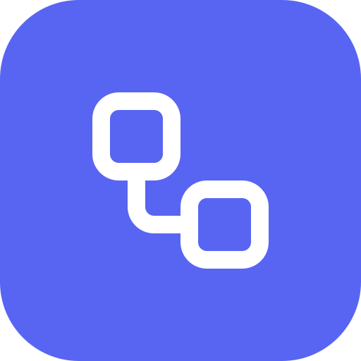
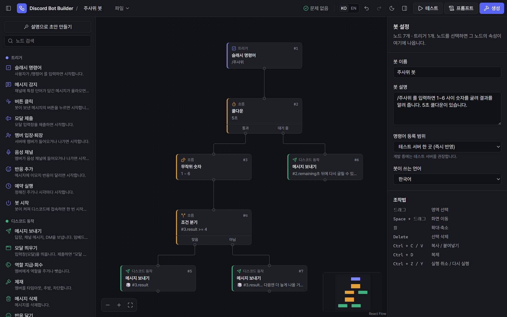
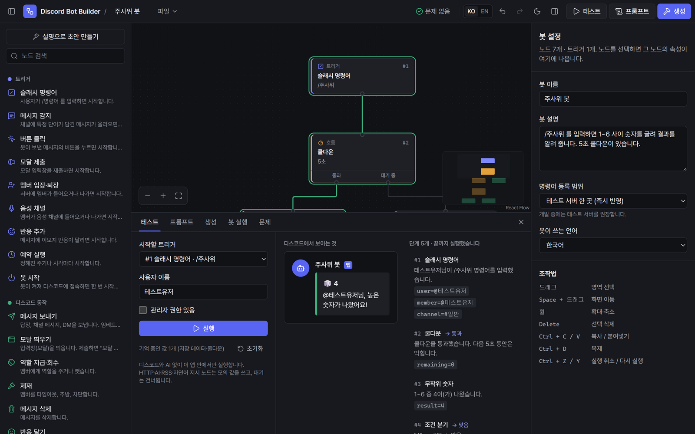
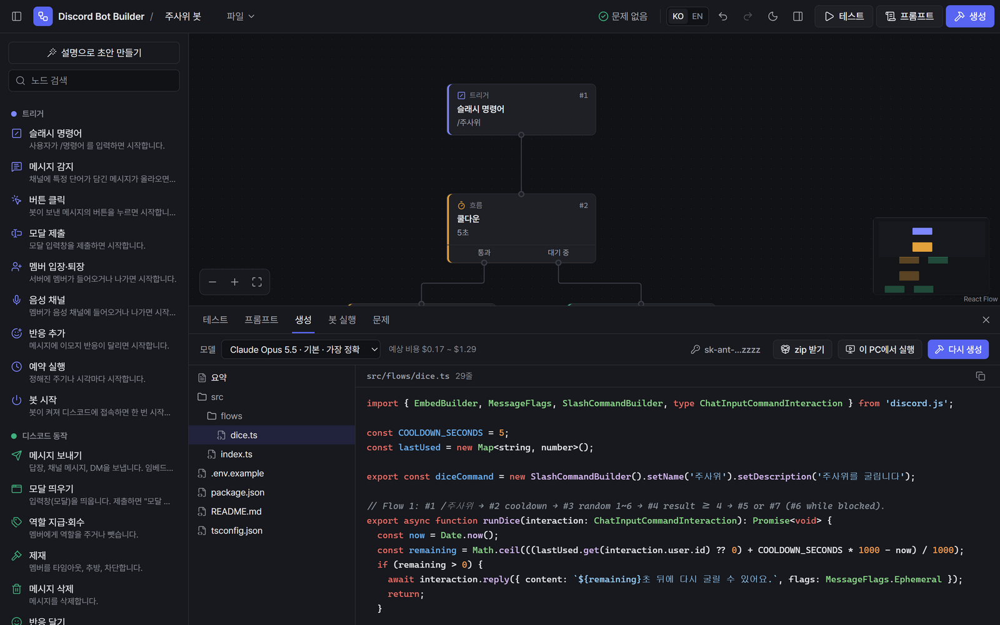
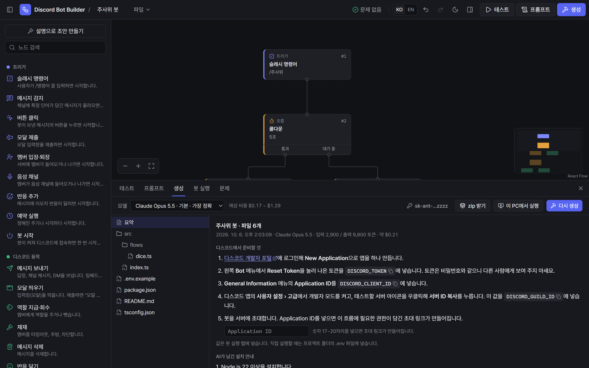
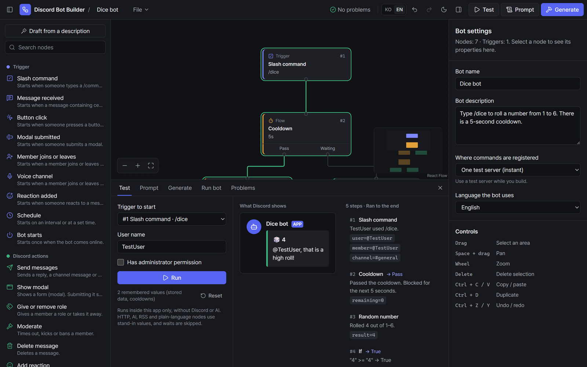

<div align="center">



# Discord Bot Builder

**디스코드 봇을 노드로 설계하면, AI가 실행할 수 있는 봇 코드를 만들어 줍니다.**<br>
코딩을 몰라도 흐름을 그리고, 미리 테스트하고, 내 PC에서 바로 실행해 볼 수 있습니다.

[](https://github.com/JTech-CO/Discord-Bot-Builder/releases/latest/download/Discord-Bot-Builder-Setup.exe)
[](https://github.com/JTech-CO/Discord-Bot-Builder/releases/latest/download/Discord-Bot-Builder-mac-arm64.dmg)
[](https://github.com/JTech-CO/Discord-Bot-Builder/releases/latest/download/Discord-Bot-Builder-mac-x64.dmg)

[](https://github.com/JTech-CO/Discord-Bot-Builder/releases)




</div>

## 다운로드

| 운영체제 | 파일 | 형식 |
|---|---|---|
| Windows 10 · 11 (64비트) | [`Discord-Bot-Builder-Setup.exe`](https://github.com/JTech-CO/Discord-Bot-Builder/releases/latest/download/Discord-Bot-Builder-Setup.exe) | 설치 프로그램 |
| macOS 13 (Ventura) 이상 · Apple Silicon (M1 이후) | [`Discord-Bot-Builder-mac-arm64.dmg`](https://github.com/JTech-CO/Discord-Bot-Builder/releases/latest/download/Discord-Bot-Builder-mac-arm64.dmg) | 디스크 이미지 |
| macOS 13 (Ventura) 이상 · Intel | [`Discord-Bot-Builder-mac-x64.dmg`](https://github.com/JTech-CO/Discord-Bot-Builder/releases/latest/download/Discord-Bot-Builder-mac-x64.dmg) | 디스크 이미지 |

이전 버전과 변경 내역은 [Releases](https://github.com/JTech-CO/Discord-Bot-Builder/releases)에 있습니다. Mac 종류는 화면 왼쪽 위 사과 메뉴 → **이 Mac에 관하여**의 "칩"(Apple M…) 또는 "프로세서"(Intel)에서 확인할 수 있습니다.

**함께 필요한 것**

- **Anthropic API 키:** 앱 안에서 봇 코드를 만들 때 씁니다. 요금은 키 주인에게 청구되며, 봇 하나를 만드는 데 보통 $0.2~1.3 정도입니다(생성 전에 예상 비용이 표시됩니다). 키가 없으면 프롬프트를 복사해 다른 AI에 붙여 넣어도 됩니다.
- **[Node.js](https://nodejs.org/) 22 이상:** 만든 봇을 이 PC에서 실행할 때만 필요합니다.
- **디스코드 테스트 서버:** 봇을 초대해 써 볼 서버입니다. 토큰과 ID를 가져오는 방법은 앱이 단계별로 안내합니다.

## 설치

**Windows:** 내려받은 `Setup.exe`를 실행합니다. 관리자 권한 없이 설치되고 바탕화면과 시작 메뉴에 바로가기가 생깁니다. 처음에 "Windows의 PC 보호" 창이 뜨면 **추가 정보 → 실행**을 누르세요(아직 코드 서명 전이라 나오는 경고입니다).

**macOS:** `.dmg`를 열고 앱을 **응용 프로그램** 폴더로 끌어 놓습니다. 처음 열 때 "확인되지 않은 개발자" 경고가 뜨면 **시스템 설정 → 개인정보 보호 및 보안**에서 **그래도 열기**를 누르세요(아직 Apple 공증 전이라 나오는 경고입니다).

## 사용 방법

1. **설계:** 왼쪽 목록의 노드를 캔버스에 놓고 잇습니다. 만들고 싶은 봇을 글로 설명하면 Claude가 초안을 그려 주고, 예제(주사위 봇)로 시작해도 됩니다.
2. **테스트:** 디스코드나 AI 없이 가짜 이벤트로 흐름을 실행해, 지나간 노드와 디스코드에 보일 메시지를 미리 봅니다.
3. **생성:** API 키를 넣고 **봇 코드 생성**을 누르면 discord.js · TypeScript 프로젝트가 만들어집니다. 파일별로 확인하고 zip으로 받을 수 있습니다.
4. **실행:** **봇 실행** 탭에서 폴더에 저장하고 토큰을 넣은 뒤 실행하면, 설치·빌드·실행을 앱이 알아서 하고 로그를 보여 줍니다.

## 화면

<table>
  <tr>
    <td width="50%"></td>
    <td width="50%"></td>
  </tr>
  <tr>
    <td><b>테스트</b> · 가짜 이벤트로 흐름을 돌려 지나간 경로와 디스코드에 보일 메시지를 확인합니다.</td>
    <td><b>생성</b> · Claude가 만든 프로젝트를 파일별로, 문법 색상과 함께 봅니다.</td>
  </tr>
  <tr>
    <td></td>
    <td></td>
  </tr>
  <tr>
    <td><b>디스코드 준비 안내</b> · 토큰과 ID를 어디서 가져오는지, 켤 인텐트, 권한이 담긴 초대 링크까지 알려 줍니다.</td>
    <td><b>한국어 · English</b> · 상단의 KO / EN으로 화면 언어를 바로 바꿉니다.</td>
  </tr>
</table>

## 주요 기능

- **노드 32종:** 슬래시 명령어, 메시지·버튼·모달·반응·음성·예약 트리거, 메시지 보내기·역할·제재, 조건·분기·확률·쿨다운, 포인트 같은 저장 데이터, HTTP·AI·웹훅·RSS, 그리고 노드로 만들기 어려운 동작을 말로 맡기는 노드.
- **실시간 검사:** 빈 칸, 잘못된 형식, 없는 변수, 연결되지 않은 노드, 입력칸에 섞인 비밀값을 문제 탭에 바로 보여 줍니다.
- **설명으로 초안 만들기:** "출석하면 포인트를 주는 봇"처럼 적으면 노드 흐름 초안이 캔버스에 놓입니다.
- **디스코드 준비 안내:** 개발자 포털에서 할 일을 단계별로 보여 주고, 필요한 권한이 담긴 초대 링크를 만들어 줍니다.
- **한국어 · English:** 화면 전체와 예제를 두 언어로 제공합니다.

## 키와 토큰은 이렇게 다룹니다

- 데스크톱 앱은 API 키와 봇 토큰을 운영체제의 암호화 저장소(Windows DPAPI, macOS 키체인)에 보관하며, 저장한 값은 화면에서 다시 볼 수 없습니다.
- API 키는 Anthropic(`api.anthropic.com`)으로만 전송되며, 봇 토큰은 봇을 실행할 때만 넘겨줍니다. 프로젝트 폴더에 `.env` 파일을 만들지 않고, 로그에 찍힌 비밀값은 가립니다.
- AI가 만든 코드는 실행 전에 확인하라고 알려 주며, 패키지는 설치 스크립트를 끈 채 설치합니다.

## 직접 빌드하기

```bash
cd app
npm install
npm run dev            # 웹 버전 (http://localhost:5173)
npm run desktop        # 데스크톱 앱
npm run dist:win       # Windows 설치 파일 (Windows에서)
npm run dist:mac       # macOS 설치 파일 (macOS에서)
```

`v`로 시작하는 태그(예: `v2.0.0`)를 올리면 GitHub Actions가 Windows와 macOS 설치 파일을 만들어 릴리스에 올리고, 위 다운로드 링크가 그 릴리스를 가리킵니다.
